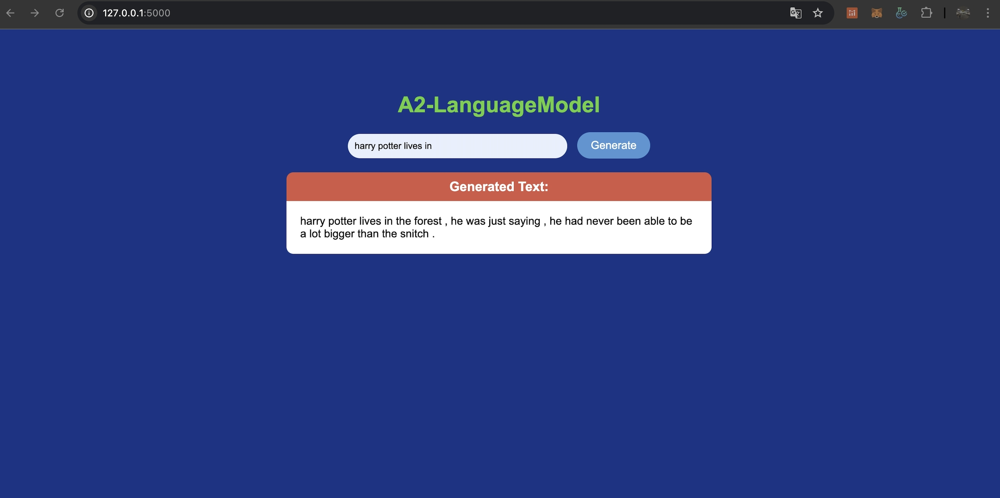

# A2-Language-Model
## st124738
## Sonakul kamnuanchai
## Objective
Producing cohesive and contextually appropriate content derived from a specified input using language model.

## Citation data source
- Dataset harry potter : https://huggingface.co/datasets/KaungHtetCho/Harry_Potter_LSTM

## The steps taken to preprocess the text data
- Step 0 : Load dataset from huggingface by datasets.load_dataset('xxxxxx')
- Step 1 Tokenizing : Split sentences into tokens using get_tokenizer("basic_english").
- Step 2 Numericalization : Convert tokens into numerical indices using a vocabulary created with build_vocab_from_iterator
- Step 3 Add Special Tokens : Mark the start and end of sequences and pad shorter sequences. For example ['unk', 'pad', 'sos', 'eos', '.', ',', 'the', 'and', 'to', "'"]

##  The model architecture and the training process
- Modeling : This assignment use LSTM-based language model. This model is a type of recurrent neural network (RNN) designed to predict the next token in a sequence. The key components include : 
Embedding Layer: Converts token indices into dense vector representations. 
LSTM Layer: Processes the sequence and captures dependencies between tokens. 
Dropout Layer: Prevents overfitting by randomly deactivating neurons during training. 
Fully Connected (FC) Layer: Maps LSTM outputs to the vocabulary size to predict the next token.

- Model Parameters :
vocab_size = 9805 
emb_dim = 1024 
hid_dim = 1024            
num_layers = 2 
dropout_rate = 0.65            
lr = 1e-3

- Training process : Train the model to predict the next token in a sequence using Cross-Entropy Loss (nn.CrossEntropyLoss()). 
Forward : Get prediction (probabilities over the vocabulary) and updated hidden states. 
Compute Loss : Use Cross-Entropy Loss to compare predictions with the validation tokens. 
Backward : Compute gradients via backpropagation 
Training with 50 epochs

## How to run the application:
- Step1 : Download model files from this link : https://drive.google.com/file/d/1I5EZ0uuKDJZ9kwOyPVj12bX5haoavnqN/view?usp=sharing
- Step2 : Move best-val-lstm.pt into Model/
- Step3 : python app.py

## Screenshot demo web application with temperature = 0.5

